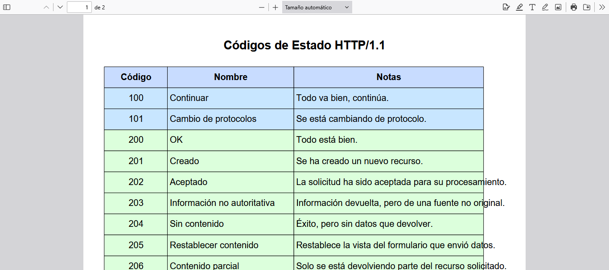

# HTTP_status_codes
# 📄 Códigos de Estado HTTP/1.1 – PDF generado con Python

Este proyecto genera automáticamente un archivo PDF educativo con los códigos de estado HTTP/1.1 en español, usando Python y la librería `fpdf`.

Incluye:
- Más de 40 códigos organizados por categoría (1xx, 2xx, 3xx, 4xx, 5xx)
- Descripciones breves

  

